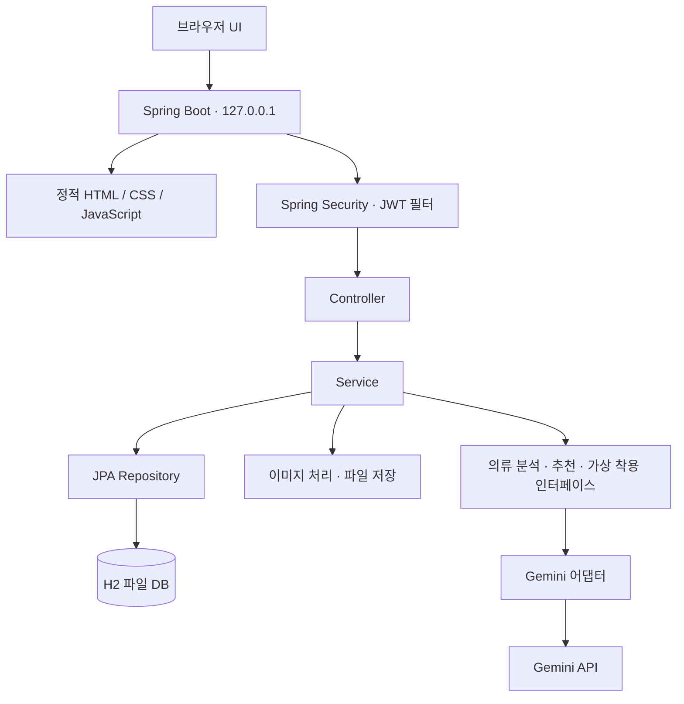

# orbit-local

자기 PC에서 옷을 등록하고, 코디를 추천받아 날짜별로 기록하는 개인용 옷장 앱입니다.
학사 졸업작품 Orbit의 옷장과 코디 기능을 Kotlin과 Spring Boot로 다시 만들었습니다.

개인 프로젝트로 서버, 브라우저 UI, Gemini 연동, 테스트와 Windows 패키징을 작업했습니다.
Spring Boot가 화면과 API를 함께 실행하며, 데이터는 PC의 H2 파일 DB와 이미지 폴더에 저장합니다.
화면은 일본어 인터페이스를 사용하고, 시스템 설정에 따라 다크 모드가 켜집니다.

## 개발 배경

기존 Orbit에는 서명과 만료가 없는 이메일 기반 인증과 코디 저장 트랜잭션 누락 문제가 있었습니다.
새로 구현하면서 인증 처리를 필터로 모으고, 코디와 하위 아이템이 한 트랜잭션에서 묶여 저장되도록 바꿨습니다.
외부 AI 호출도 인터페이스 뒤로 격리해 응답 오류나 호출 실패 상황을 테스트에서 재현할 수 있게 만들었습니다.

사용 환경은 개인이 로컬 PC에서 단독으로 쓰는 형태로 단순화했습니다.
별도 프론트엔드 서버 없이 브라우저에서 바로 사용하며, Windows 배포본에는 Java 런타임을 포함했습니다.

## 주요 기능

### 사진으로 옷 등록

사진을 올리면 Gemini가 이름, 카테고리, 색, 소재, 핏, 계절을 분석해 제안합니다.
분석 결과는 등록 폼에 미리 채워지며, 사용자가 내용을 확인하고 수정한 뒤 저장합니다.

### 옷장에 맞춘 코디 추천

등록해 둔 옷과 스타일 선호도, 이번 추천에 입력한 상황을 함께 반영합니다.
추천 이유와 당시 상황도 코디 기록에 함께 남겨 선택 배경을 나중에 확인할 수 있게 했습니다.
서버는 응답에 포함된 의류의 소유권과 상의·하의 각 한 벌, 아우터 최대 한 벌 조합을 검사합니다.

| 추천 조건 | 처리 |
| --- | --- |
| 상의나 하의가 없는 경우 | HTTP 400으로 필요한 의류를 안내합니다. |
| 오늘 나온 조합과 겹친 경우 | HTTP 409, `duplicate`, `retry: true`를 반환합니다. |
| 오늘 가능한 조합을 모두 사용한 경우 | AI 호출 전에 HTTP 409, `exhausted`, `retry: false`로 종료합니다. |

### 가상 착용과 코디 기록

전신 사진과 코디에 포함된 의류 사진을 조합해 가상 착용 이미지를 만듭니다.
결과가 마음에 들지 않으면 코디 데이터는 남겨둔 채 가상 착용 이미지만 골라 삭제할 수 있습니다.

수동으로 조합한 코디도 날짜와 LOOK 번호로 누적 기록하며, 즐겨찾기로 모아 볼 수 있습니다.
옷장 통계와 의류별 착용 기록을 조회할 수 있고, 과거 코디에 쓰인 옷은 소프트 삭제 처리해 이전 기록이 깨지지 않게 보존합니다.

## 기술 스택

| 구분 | 사용 기술 |
| --- | --- |
| 서버 | Kotlin 2.2, JDK 21, Spring Boot 3.5 |
| 인증 | Spring Security, JWT(jjwt), BCrypt |
| 데이터 | Spring Data JPA, H2 파일 DB, MySQL 프로파일 |
| 화면 | HTML, CSS, 바닐라 JavaScript |
| AI | Gemini API |
| 검증·패키징 | JUnit 5, GitHub Actions, jpackage |

## 아키텍처



화면 코드는 `src/main/resources/static`에 두고 서버가 정적 파일로 내려줍니다.
AI 호출과 코디 저장을 분리해 외부 API 응답을 기다리는 동안 DB 트랜잭션을 물고 있지 않게 했습니다.
테스트에서는 AI 인터페이스에 가짜 구현을 주입합니다.

화면 구성과 스타일 기준은 [디자인 명세](DESIGN.md)에 정리했습니다.

## 구현에서 정한 기준

### 자동 세션과 로컬 접근 범위

로컬 단독 사용 앱이라 별도 로그인 화면을 두지 않고 `POST /api/auth/session`으로 토큰을 자동 발급받습니다.
이후 요청은 JWT 필터에서 서명과 만료를 검사하며, 공개 경로를 제외한 모든 요청에 인증을 요구합니다.

자격증명 입력 없이 토큰을 발행하는 구조이므로 서버는 외부 망에 열지 않고 `127.0.0.1`에만 바인딩했습니다.
다만 같은 PC 내부의 다른 프로세스 접근까지 물리적으로 차단하지는 못합니다.
다인 접속 환경으로 전환하려면 외부에 포트를 열기 전에 사용자 인증 체계부터 다시 구축해야 합니다.

### 코디 저장과 삭제 후 기록 유지

코디 본체와 포함된 아이템 목록은 단일 트랜잭션으로 묶어 저장합니다.
아이템 저장 중 제약 조건 위반이 발생했을 때 코디만 따로 저장되지 않고 롤백되는지를 테스트로 검증했습니다.

과거 코디에 사용했던 옷을 삭제하면 `deletedAt` 컬럼에 시점을 남겨 옷장 화면, 통계 집계, 추천 후보군에서만 제외합니다.
실제 행과 이미지 파일은 그대로 보존해 이전 코디 상세 화면에서 계속 볼 수 있습니다.
코디 번호(LOOK 번호)도 생성 시점에 고정 저장해 앞선 순번의 코디를 지워도 기존 번호 체계가 밀리지 않습니다.

## 트러블슈팅

### 코디 목록 페이징 요청 시 전체 데이터를 메모리로 읽어오는 문제

코디 목록 화면에서 연관된 의류 데이터까지 한 번에 가져오려고 컬렉션 fetch join과 페이징 처리를 같이 걸었습니다.
애플리케이션을 구동해 보니 Hibernate가 전체 행을 조회한 뒤 메모리에서 페이지를 자르고 있었습니다.
로그에 남은 `HHH000104` 경고와 생성 쿼리를 살펴보니, 1:N 조인 결과의 행 기준이 코디 단위가 아니라 코디-아이템 조합 단위로 뻥튀기되는 것이 원인이었습니다.

조회를 두 단계로 분리했습니다. 먼저 코디 ID 목록만 페이징으로 끊어 가져온 뒤, 확보한 ID 목록을 조건으로 코디와 의류 엔티티를 fetch join으로 조회하도록 바꿨습니다.
페이지 크기를 2로 두고 코디를 3건에서 10건으로 늘려도 전체 조회 쿼리가 3회로 유지되는지 확인했습니다.
빈 첫 페이지를 요청할 때는 연관 데이터를 조회하는 후속 쿼리를 건너뛰는지도 함께 점검했습니다.

관련 코드: [목록 조회](src/main/kotlin/com/orbit/service/CoordinationService.kt), [영속성 테스트](src/test/kotlin/com/orbit/PersistenceBehaviorTest.kt)

### 가상 착용 결과에서 얼굴이 변형되는 문제

가상 착용을 실행하면 옷만 합성되는 것이 아니라 인물의 얼굴 생김새까지 바뀌어 나왔습니다.
프롬프트를 다듬어 보아도 앱 안에서는 같은 문제가 계속됐는데, API를 직접 호출하면 얼굴이 유지된 정상 결과가 나왔습니다.
로컬 프록시를 띄워 앱에서 나가는 실제 HTTP 페이로드를 가로채 확인했습니다.

코드 기본값과 달리 설정 파일(`application.yml`)의 모델 키가 다른 모델명을 가리키고 있었습니다.
설정 파일의 모델 지정을 올바르게 바로잡아 해결했고, 이후에는 입력 이미지와 결과 이미지의 이미지 크기가 동일하게 유지되는지를 회귀 확인 신호로 삼았습니다.

관련 설정: [application.yml](src/main/resources/application.yml)

### 업로드 상한 조정 후에도 대용량 사진이 거절되는 문제

고해상도 사진 저장을 위해 서버의 파일 업로드 상한을 8MB에서 40MB로 풀었는데도 여전히 화면에서 업로드가 막혔습니다.
원인을 찾아보니 프론트엔드 자바스크립트 코드에 10MB 크기 검사 로직이 하드코딩되어 있었습니다.
화면과 서버에 제한 수치가 파편화되어 한쪽만 변경했던 실수였습니다.

이후 업로드 크기 상한 자체를 없앴고, 대신 용량이 큰 JPEG와 PNG는 서버 저장 시점에 긴 변 기준 1600px 이하로 리사이징하도록 구현했습니다.
고화질 원본을 읽을 때 발생하는 메모리 낭비를 줄이기 위해 디코딩 단계에서 픽셀을 건너뛰는 서브샘플링을 적용했습니다.
테스트 코드로 대용량 이미지 등록 성공 여부, 저장된 이미지의 해상도 규격, EXIF 회전각 보정, PNG 투명 배경 유지 여부를 검증합니다.
WebP 포맷은 별도 디코더를 두지 않아 축소 없이 원본 그대로 저장합니다.

관련 코드: [이미지 처리](src/main/kotlin/com/orbit/media/ImageNormalizer.kt), [이미지 검증](src/test/kotlin/com/orbit/ImageNormalizationTest.kt)

## 실행 방법

### 소스 빌드 실행

JDK 21 환경에서 저장소를 복제한 뒤 실행합니다.

```bash
./gradlew bootRun
```

Windows 환경에서는 `.\gradlew.bat bootRun`을 사용합니다.
서버가 뜨면 브라우저로 `http://127.0.0.1:8080`에 접속합니다. 자동 세션이 발급되며 옷장 메인 화면으로 이동합니다.

AI 기능은 앱 화면의 `その他 → AI連携` 메뉴에서 키를 입력하거나 환경 변수로 전달합니다.
키가 등록되지 않아도 옷장 정리와 수동 코디 기능은 정상 동작하며, AI 호출 API만 503 오류를 반환합니다.

| 환경 변수 | 용도 |
| --- | --- |
| `GEMINI_API_KEY` | 의류 분석, 코디 추천, 가상 착용에 사용하는 API 키 |
| `ORBIT_JWT_SECRET` | JWT 서명 비밀키 (생략 시 개발용 기본값 적용) |
| `ORBIT_HOME` | DB, API 키, 미디어의 기본 데이터 루트 |
| `ORBIT_MEDIA_DIR` | 이미지 저장 폴더만 별도 경로로 분리할 때 사용 |

### Windows 배포본 실행

Releases 탭에서 `Orbit-1.1.0-windows-portable.zip`을 내려받아 압축을 풀고 `Orbit.exe`를 실행합니다.
전용 JRE가 패키징에 포함되어 있어 로컬에 JDK가 없어도 바로 돕니다.
브라우저 탭을 닫아도 백그라운드에서 계속 실행되므로, 프로세스를 완전히 끄려면 작업 표시줄 알림 영역의 트레이 아이콘에서 종료를 눌러야 합니다.

jpackage 툴체인의 크로스 컴파일 제약 때문에 패키징 빌드는 GitHub Actions의 Windows 러너에서 별도로 처리합니다.
포터블 ZIP 패키지를 기본으로 만들고, WiX Toolset 환경이 잡혀 있으면 MSI 설치 파일도 함께 빌드합니다.
세부 빌드 과정은 [패키징 워크플로](.github/workflows/windows-package.yml)와 [Windows 패키징 문서](packaging/TESTING-ko.md)를 참고하면 됩니다.

## 데이터 저장 경로

| 운영체제 | 기본 경로 |
| --- | --- |
| Windows | `%LOCALAPPDATA%\Orbit` |
| macOS | `~/Library/Application Support/Orbit` |
| 그 외 | `~/.local/share/orbit` |

지정된 데이터 루트 경로 아래의 `db/orbit.mv.db`에 메타데이터가 기록되고, `media` 폴더에 업로드한 이미지 파일이 보관됩니다.

## 테스트와 한계

```bash
./gradlew test
```

테스트는 H2 인메모리 데이터베이스를 바라보도록 설정했습니다.
외부 통신 비용과 불확실성을 없애기 위해 Gemini 연동 빈은 비활성화하고 가짜 어댑터 객체를 주입해 검증합니다.
JWT 위변조, 토큰 만료, 접근 토큰과 갱신 토큰의 타입 혼용 검증, 리소스 소유권 확인, 저장 실패 시 롤백, AI 추천 응답 파싱 실패 처리를 테스트 케이스로 작성했습니다.
GitHub Actions의 [테스트 워크플로](.github/workflows/test.yml)에서 매 푸시와 풀 리퀘스트마다 테스트를 돌리고 리포트 아티팩트를 보관합니다.

* 가상 착용 이미지 생성 요청을 현재 HTTP 스레드에서 동기 방식으로 처리하며, 작업 큐 기반의 비동기 처리로 분리하지 않았습니다.
* 리프레시 토큰을 회전시키지 않고 개별 토큰을 폐기하는 기능이 없어, 특정 토큰만 강제로 무효화할 수 없습니다.
* 소프트 삭제된 옷을 포함하고 있던 과거 코디까지 완전히 삭제되었을 때, 디스크에 남은 이미지 실물 파일을 찾아서 청소하는 가비지 컬렉션 처리가 빠져 있습니다.
